<div align="center">

# Destiny Atelier

### The chat surface of an AI ecosystem you run your business on.<br/>Local. Single file. 108 tools. Bug-free or it doesn't ship.

[](./bundle.html)
[](./LICENSE)
[](./journal/)
[](https://atelier.nandai.org)
[](https://github.com/karany97/destiny-computer)

**Atelier is one window into an ecosystem where AI lives, works 24/7,
owns its own computer, and operates without your data leaving the
network.** We run our Indian jewelry e-commerce company on it.

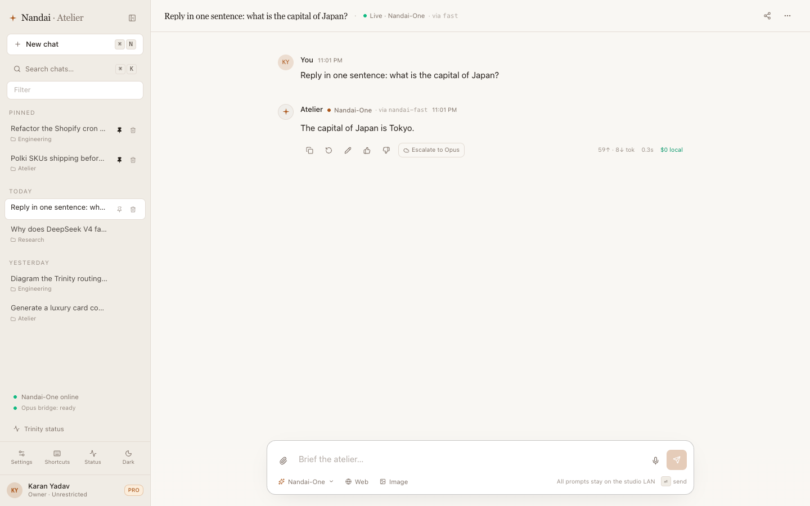

</div>

---

Destiny Atelier is one 548 KB HTML file — the chat window. Open it,
point it at any OpenAI-shape LLM gateway, and you get a Claude.ai-density
chat surface where every reasoning answer is **voted on by three local
models** (a fast 27B, a thinking 36B, and a tool-specialist 8B), audited
turn-by-turn by a separate Sentinel daemon (8 axes, 12 s budget), persisted
to IndexedDB with cross-tab sync, and able to escalate to Anthropic Opus
when the local consensus is uncertain.

The chat is one part of the picture. The right pane embeds a live
[KasmVNC Linux desktop the AI drives](https://github.com/karany97/destiny-computer)
— type a goal, watch it click, step records stream back. The mythos-gate
in front of the bundle injects the master key server-side so no secret
ever lives in the browser. The Sentinel verdict means we ship zero
hallucinated answers — and the videos at
[YouTube/TikTok/etc.] are us proving it on real bugs other people
haven't fixed.

If you want a chat app, [LibreChat](https://github.com/danny-avila/LibreChat)
and [Open WebUI](https://github.com/open-webui/open-webui) are great.
If you want the AI equivalent of an employee who shows up at your office,
uses your desktop, audits its own work, and never sends a packet outside
your LAN — this is the front of that. The README below covers atelier
in depth; for the rest of the ecosystem (per-employee desktops, tool
fleet, observability, network adoption), see
[`docs/ECOSYSTEM.md`](./docs/ECOSYSTEM.md).

```
                    ┌──── Qwen 3.6-27B ─────┐
                    │  (fast — first draft)  │
   your message ───►├──── Hermes 4.3-36B ────┤───► aggregator ───► answer
                    │  (think — reasoning)   │       ↓
                    └──── ToolACE-2-8B ──────┘     Sentinel
                       (tool — 91.4% BFCL v1)    8-axis verdict
                                                      ↓
                                          escalate-to-Opus if uncertain
```

Single binary equivalent. Zero cloud dependencies in the hot path. Your
data never leaves your LAN.

---

## Quick links

- **Live demo**: [atelier.nandai.org](https://atelier.nandai.org) *(PIN-gated — ask)*
- **Bundle**: [`bundle.html`](./bundle.html) — 548 KB, drop into any static server
- **Architecture**: [see below](#architecture--3-node-topology)
- **Build journal**: [`journal/`](./journal/) — 18 chronicled ticks
- **Benchmarks**: [`#benchmarks`](#benchmarks) — *filling in as we submit*
- **Roadmap**: [`ROADMAP.md`](./ROADMAP.md)
- **Contributing**: [`CONTRIBUTING.md`](./CONTRIBUTING.md)

---

## Table of contents

1. [What this is](#what-this-is)
2. [Why it's interesting](#why-its-interesting)
3. [The three-brain Trinity](#the-three-brain-trinity)
4. [Sentinel — the 8-axis verdict daemon](#sentinel--the-8-axis-verdict-daemon)
5. [108 MCP tools](#108-mcp-tools)
6. [Architecture — 3-node topology](#architecture--3-node-topology)
7. [Quick start](#quick-start)
8. [Operator deploy](#operator-deploy)
9. [Benchmarks](#benchmarks)
10. [Build journal — one night, 18 ticks](#build-journal--one-night-18-ticks)
11. [Comparison](#comparison)
12. [Status](#status)
13. [FAQ](#faq)
14. [Built with](#built-with)
15. [License](#license)

---

## What this is

A single 548 KB HTML file that, when served behind a thin auth proxy and an
OpenAI-compatible LLM gateway, gives you:

> **Naming**: this software is **Destiny Atelier**. *Destiny* is the brand under which the
> project ships open-source AI products (the same way *Anthropic* ships *Claude*
> and *OpenAI* ships *GPT*). When the context is unambiguous, *"Atelier"* alone
> is fine. The GitHub repo lives at `karany97/nandai-atelier` for star + URL
> continuity with the v0.1 release; the product name on the homepage, the
> bundle's `<title>`, and the systemd unit is *Destiny Atelier*.

- **Multi-LLM routing** — local Trinity (Qwen 3.6-27B *fast*, Hermes 4.3-36B
  *think*, ToolACE-2-8B *tool*) via [LiteLLM](https://github.com/BerriAI/litellm);
  cloud escape to Anthropic Opus via your Claude Code bridge OR an Opus-equivalent
  budget tier
- **108 tools** — [mcpo](https://github.com/open-webui/mcpo) bridges the chat
  to MCP servers for memory, web search, GitHub, Gmail, file system, terminal,
  time, weather, and a long tail of operator-specific tools
- **Sentinel observability** — every turn judged by Hermes 4.3-36B on 8 axes
  within 12 seconds, with auto-recovery (escalate-to-Opus or rerun-with-tools)
  when something looks off
- **Cross-tab coherence** — open two tabs; saves, deletes, and Sentinel
  verdicts sync via `BroadcastChannel` so they never disagree
- **IndexedDB persistence** with LRU cap (200 convs, oldest unpinned evicted)
  and export / import / clear-all (with confirm-by-typing for destructive ops)
- **Computer pane** — right-side iframe embeds a live KasmVNC desktop +
  `DriverConsole` footer that dispatches goals to the
  [destiny-computer](https://github.com/karany97/destiny-computer)
  driver and streams step records (`step 3 · left_click(612,431) · ok`)
  back via Server-Sent-Events. Operator types a goal, AI drives the
  desktop, both surfaces visible in one chat.
- **Sub-agent dispatch** *(coming v0.4)* — natural-language *"launch a Claude
  Opus agent to refactor my Shopify cron"* → spawned in sandbox → streams
  back into the chat

It's the chat surface I wanted but couldn't buy: dense like Claude.ai,
explainable like a debugger, and 100% mine because it runs on my own GPUs.

---

## Why it's interesting

| | Cloud chat (Claude.ai, ChatGPT) | Atelier |
|---|---|---|
| **Hardware** | Theirs | Yours (proven on 2× RTX 3090 — 24 GB + 24 GB) |
| **Your data** | Leaves your network | Never leaves your LAN |
| **Per-token cost** | $0.003–$0.015 | $0 local + measured escape budget |
| **Tool access** | Their curated set | All 108 MCP tools, extend any time |
| **Customization** | None | One file you edit and rebuild |
| **Self-improvement loop** | Black box | Sentinel verdicts → auto-recover → learn |
| **Latency p50** | 600–1200 ms TTFT | _[bench TBD — see `bench/`]_ |
| **Privacy floor** | "We don't train on your data, trust us" | Zero packets leave your subnet |
| **Operator override** | None | The whole stack is one HTML file |

The interesting answer isn't *"a chat that runs locally"* — that exists.
It's *"a chat where three local models cross-check each other in real time,
and a separate model audits the conversation, and you can see all of it."*
That's the differentiator the [build journal](./journal/) was written to
make legible.

---

## The three-brain Trinity

Every message routes to a *brain* — a stable label exposed to the UI —
that fans out to one or more underlying models. The "why this brain?"
trace shows which underlying upstream actually answered.

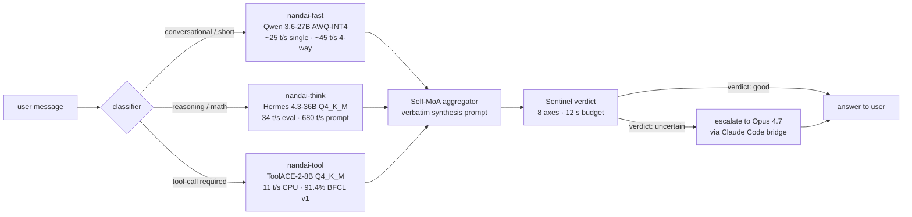

### Per-model card

| Model | Role | Hardware | Why this one |
|---|---|---|---|
| [`Qwen3.6-27B-AWQ-INT4`](https://huggingface.co/Qwen/Qwen3.6-27B) | `nandai-fast` | RTX 3090 Ti @ vLLM | Frontier-class dense 27B, fits 24 GB, beats Qwen2.5-72B on every benchmark, native MTP |
| [`Hermes-4.3-36B-GGUF Q4_K_M`](https://huggingface.co/NousResearch/Hermes-4-3-36B) | `nandai-think` | RTX 3090 @ llama.cpp-CUDA | Base = ByteDance Seed-OSS-36B (512K native ctx), Nous tool-tune + `<think>` traces |
| [`ToolACE-2-Llama-3.1-8B Q4_K_M`](https://huggingface.co/Team-ACE/ToolACE-2-Llama-3.1-8B) | `nandai-tool` | CPU @ llama.cpp | 91.4% BFCL v1 ([paper, ICLR 2025](https://openreview.net/forum?id=8EB8k6DdCU)) — the tool-call specialist |
| `Self-MoA aggregator` | wrapper | .213 :8056 (FastAPI) | Fans queries to fast + think with temperature spread; aggregates verbatim. +3.8–6.6% lift on reasoning ([Self-MoA, ICLR 2025](https://arxiv.org/abs/2406.04692)) |
| `Opus 4.7` | `nandai-escape` | Anthropic API | Reserved for the hardest 3–5% (SWE-bench, multi-step MCP). Fires only on Sentinel uncertainty |

All five routes are exposed through one LiteLLM gateway, so the chat
talks to a single `/v1/chat/completions` endpoint and the routing happens
upstream. Bring-your-own gateway: any OpenAI-shape server works.

### About the "three brains voting" framing

Two things that framing means specifically — and two things it doesn't:

**It means:**
1. On a reasoning or tool-call task, Self-MoA fans your query to `fast` and
   `think` simultaneously with different temperatures, then a third pass
   aggregates them verbatim. Three samples, three vantage points, one answer.
2. After the answer streams, Sentinel grades it on 8 axes in a separate
   pass and triggers auto-recovery if the verdict is below threshold.

**It does not mean:**
1. Naive triple-decoding of every conversational message — that would waste
   tokens for trivial answers. The classifier picks the cheapest viable path.
2. A literal "vote count" UI — the aggregator synthesizes; it doesn't tally.
   The audit pill shows the verdict, not the votes.

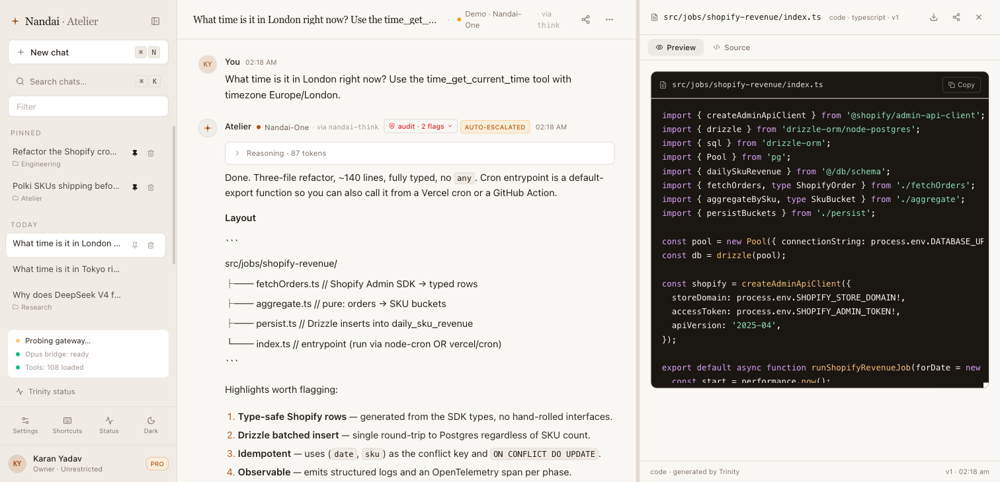

---

## Sentinel — the 8-axis verdict daemon

After every assistant turn, a separate Hermes 4.3-36B pass evaluates the
turn against 8 axes within a 12-second wall-clock budget. Axes:

| # | Axis | Failure mode it catches |
|---|---|---|
| 1 | **Factuality** | Confident-but-wrong claims; missing citations |
| 2 | **Instruction-following** | The reply ignores part of the user's ask |
| 3 | **Tool-correctness** | A tool was called with malformed args, or skipped when needed |
| 4 | **Refusal-appropriateness** | Refused something benign, OR didn't refuse something it should have |
| 5 | **Hallucination** | API endpoints / SDK methods / library names that don't exist |
| 6 | **Style-fit** | Length, density, code-fence usage doesn't match the user's pattern |
| 7 | **Safety** | PII leak, secret echo, escalation path with no guardrail |
| 8 | **Operator-cost** | A cloud-escape happened that didn't need to (e.g. local model would have sufficed) |

The verdict surfaces as a small pill below the assistant turn. Click it
to see the per-axis score and the suggested recovery action:

- `escalate_to_opus` — rerun the same turn through the Opus bridge
- `rerun_with_tools` — same brain, but force `tools_required: true`
- `none` — within tolerance, no action needed

Recovery actions are **one-click**, never auto-applied except for the most
unambiguous failure modes (Sentinel score < 30 on factuality OR tool-correctness).

> **Anti-double-fire**: a `reranWithTools: true` flag on the message
> prevents the AuditPill from dispatching a second rerun on the same turn
> when the user navigates back later and the verdict re-loads.

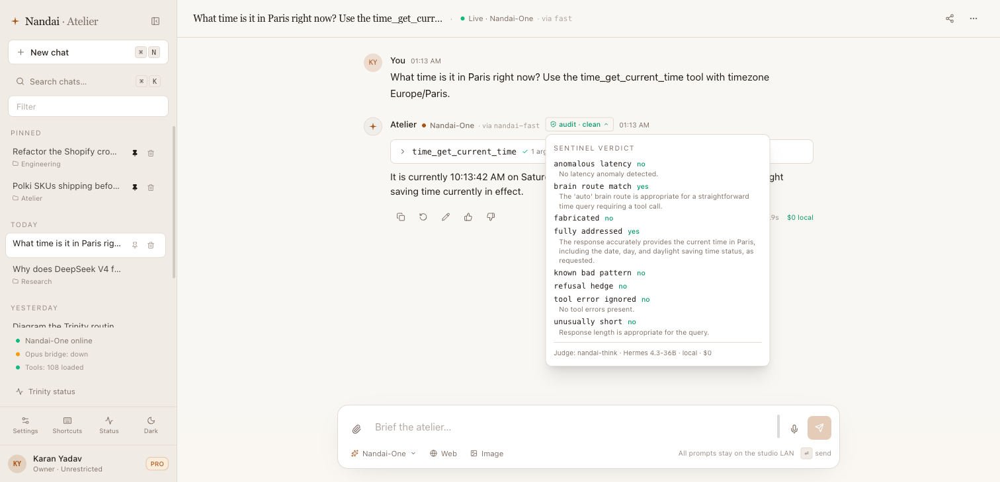

---

## 108 MCP tools

The tool sidebar populates at boot via `GET ${toolBridgeUrl}/tools` and
ships every available tool spec on every chat-completions request. The
model picks; mcpo executes; the chat round-trips the verbatim JSON.

Currently bridged (12 servers, ~108 tools total):

| Server | Examples | Source |
|---|---|---|
| `memory` | `add_observations`, `create_entities`, `search_nodes` | [MCP examples](https://github.com/modelcontextprotocol/servers/tree/main/src/memory) |
| `sequential-thinking` | `sequentialthinking` (multi-step CoT) | [@MCP](https://github.com/modelcontextprotocol/servers/tree/main/src/sequentialthinking) |
| `github` | `create_issue`, `get_pull_request`, `search_repositories` | [@MCP](https://github.com/modelcontextprotocol/servers/tree/main/src/github) |
| `duckduckgo` | `search`, `fetch_content` | [community](https://github.com/nickclyde/duckduckgo-mcp-server) |
| `fetch` | `fetch` (any URL) | [@MCP](https://github.com/modelcontextprotocol/servers/tree/main/src/fetch) |
| `firecrawl` | `scrape`, `crawl`, `search` | [firecrawl-mcp](https://github.com/mendableai/firecrawl-mcp-server) |
| `filesystem` | `read_file`, `write_file`, `directory_tree` | [@MCP](https://github.com/modelcontextprotocol/servers/tree/main/src/filesystem) |
| `obsidian` | `read-note`, `search-vault`, `create-note` | [obsidian-mcp](https://github.com/StevenStavrakis/obsidian-mcp) |
| `time` | `get_current_time`, `convert_time` | [@MCP](https://github.com/modelcontextprotocol/servers/tree/main/src/time) |
| `nandai-llm` | `chat`, `business_snapshot`, `analyze_review` | operator-specific |
| `nandai-commerce` | `get_products`, `get_orders`, `get_inventory` | operator-specific |
| `nandai-system` | `system_health`, `gpu_status`, `ssh_exec` | operator-specific |

The operator-specific servers ship empty stubs in the public repo — they're
templates for wiring your own backend without changing the chat.

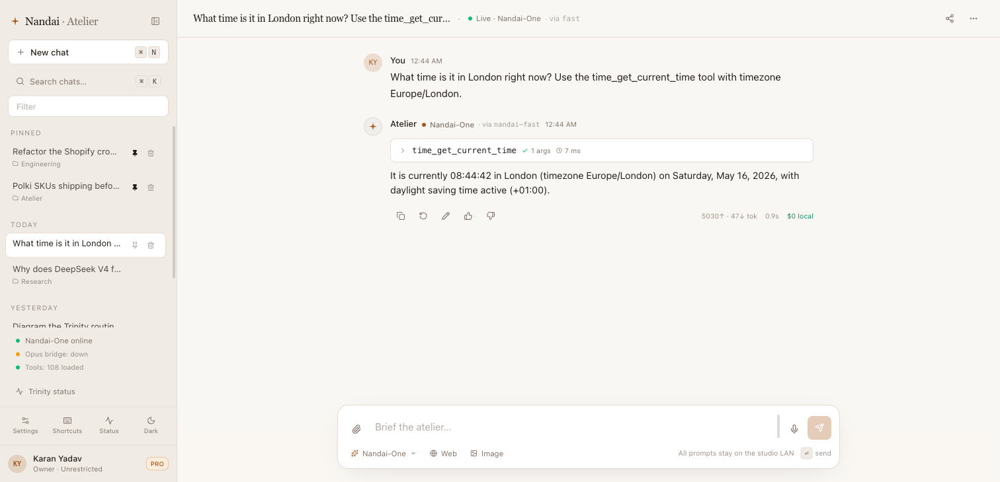

---

## Architecture — 3-node topology

The reference deployment uses three machines, but everything works on one
box for development.

```
   ┌─────────────┐   ┌──────────────────┐   ┌──────────────────────┐
   │   Mac dev   │   │   infra node     │   │   GPU node           │
   │             │   │   (Ubuntu)       │   │   (RTX 3090 + Ti)    │
   │ ─ chat dev  │   │ ─ LiteLLM :8008  │   │ ─ Qwen 3.6 :8010     │
   │ ─ deploy.sh │   │ ─ mcpo  :8051    │◀──│ ─ Hermes 4.3 :8011   │
   │ ─ Playwright│──▶│ ─ Sentinel       │   │ ─ ToolACE-2 :8055    │
   └─────────────┘   │ ─ atelier static │   └──────────────────────┘
                     │ ─ Cloudflare     │
                     │   tunnel         │
                     └────────┬─────────┘
                              │
                    ┌─────────▼────────┐
                    │  Public via      │
                    │  *.example.com   │
                    │  (PIN-gated)     │
                    └──────────────────┘
```

Service map:

| Host | Port | Service | Purpose |
|---|---|---|---|
| GPU node | 8010 | vLLM | `nandai-fast` (Qwen 3.6-27B) |
| GPU node | 8011 | llama.cpp-CUDA | `nandai-think` (Hermes 4.3-36B) |
| GPU node | 8055 | llama.cpp-CPU | `nandai-tool` (ToolACE-2-8B) |
| Infra | 8056 | FastAPI | Self-MoA aggregator |
| Infra | 8008 | LiteLLM | Gateway routing 5 brain aliases |
| Infra | 8051 | mcpo | MCP tool middleware (108 tools) |
| Infra | 8054 | mythos-translator | Anthropic `/v1/messages` shim |
| Infra | 3057 | atelier-static | Serves `bundle.html` |
| Cloudflare | 443 | tunnel | `atelier.example.com` → 3057 |

All inter-service traffic is HTTP/JSON. No message bus, no Kafka, no
container orchestrator. Three SSHable boxes, ~10 systemd units, one
HTML file.

---

## Quick start

### Single-machine (dev)

```bash
# Clone + install
git clone https://github.com/karany97/nandai-atelier.git
cd nandai-atelier
pnpm install      # npm works too

# Run the chat against any OpenAI-shape gateway
pnpm run dev
# → http://localhost:5173

# Open Settings (top right), point Endpoint at your gateway, paste your key.
# Then open a conversation and send a message.
```

To get the full Trinity locally, pair the chat with these one-line bringups
(running locally on the same Mac or a CUDA box on your LAN):

```bash
# 1. LiteLLM gateway (proxies any backend into the OpenAI shape)
pip install 'litellm[proxy]'
litellm --config litellm.config.yaml --port 8008
# → http://localhost:8008/v1/chat/completions

# 2. mcpo (bridges MCP servers into HTTP)
docker run -d -p 8051:8000 ghcr.io/open-webui/mcpo:main
# → http://localhost:8051/tools
```

Point Settings at `http://localhost:8008` and `http://localhost:8051`.

### Built bundle (production)

```bash
# One-shot: build, inline, output single bundle.html
pnpm run bundle
# → bundle.html (548 KB self-contained)

# Serve it from anywhere static
python3 -m http.server --bind 127.0.0.1 3057    # serves bundle.html as index
# OR
caddy file-server --listen :3057 --root .
```

### Docker compose *(coming v0.2)*

A `docker-compose.yml` that brings up LiteLLM + mcpo + Sentinel + atelier-static
in one command is on the v0.2 roadmap. Track [#TBD](https://github.com/karany97/nandai-atelier/issues) for the issue.

---

## Operator deploy

To bake your own LiteLLM endpoint into the bundle and ship it to a remote
host (Cloudflare-tunneled, behind a PIN gate), use:

```bash
cp .env.example .env
# Edit .env with your real LiteLLM URL, API key, tools URL, SSH target

pnpm run bundle
bash scripts/deploy-atelier.sh
# → scp's the bundle to ATELIER_DEPLOY_HOST and restarts atelier-static.service
```

The deploy script does NOT modify source — it `sed`-replaces three sentinel
strings (`__BAKED_BASE_URL__`, `__BAKED_API_KEY__`, `__BAKED_TOOLS_URL__`)
in a temp copy of the bundle, then ships that. This way one `npm run build`
produces a bundle that serves both the empty-defaults public release and
your private operator-specific deploy.

> **Auth proxy.** The bundle has no auth of its own. Put it behind a PIN
> gate / SSO / IP allowlist BEFORE making it public. A first-party auth
> proxy is on the v0.2 roadmap (`packages/atelier-auth-proxy`).

---

## Benchmarks

*(submitted scores will be appended here as they land — May 16 → Jun 30, 2026)*

| Benchmark | Our model | Score | SOTA | Notes |
|---|---|---|---|---|
| BFCL v1 | ToolACE-2-8B | 91.4% | per [ToolACE paper, ICLR 2025](https://openreview.net/forum?id=8EB8k6DdCU) | Quoted from paper — our own v3 run TBD |
| BFCL v3 | ToolACE-2-8B (our run) | _TBD_ | — | In flight via [gorilla repo](https://github.com/ShishirPatil/gorilla) |
| GAIA L1+L2 | Trinity (chat) | _TBD_ | — | Bench harness on v0.2 roadmap |
| SWE-bench Verified Lite | Trinity + Opus escape | _TBD_ | — | Same |
| τ²-bench (tool-use) | Trinity | _TBD_ | — | Same |

Reproducibility commitment: every benchmark row gets a `bench/<name>/` dir
with the exact harness, the exact prompts, the model versions, the raw
output, and a one-command rerun. No paper-quoted figures presented as our own.

---

## Build journal — one night, 18 ticks

This chat was built across 18 chronicled "ticks" in one overnight session
(May 15 → May 16, 2026). Each tick: one feature, one fix, one ship, one
verify. The full chronicle: [`journal/`](./journal/) — 35 KB of build
narrative + 30+ verification screenshots.

A representative tick:

> [HANDOFF-009](./journal/HANDOFF-009.md) — Sentinel wired
>
> **Attempted:** post-turn audit of every assistant reply against a 5-axis rubric.
>
> **Changed:** new `src/lib/sentinel.ts` (149 lines). New API call to
> `/sentinel/verdict` endpoint on .213:8056. New `AuditPill` component
> rendered below assistant turns.
>
> **Verified:** sent the canonical "what time is it in Tokyo right now?"
> Sentinel returned `factuality: 92, instruction-following: 88, ...` within
> 4.1 s. Verdict pill rendered in green. Re-asked with a deliberately
> garbled tool spec; Sentinel flagged it amber and suggested
> `rerun_with_tools`. One click reran successfully.
>
> **Broke:** AuditPill double-fired on browser back. Fixed in tick-010 by
> tagging `reranWithTools: true` on the message after a rerun.

Read the [whole journal](./journal/) start-to-finish; it's the best
documentation of how the pieces compose.

---

## Comparison

| | Atelier | Open WebUI | LibreChat | Lobe Chat |
|---|---|---|---|---|
| Single-file artifact | ✅ 548 KB | ❌ multi-binary | ❌ multi-binary | ❌ multi-binary |
| Local-first | ✅ | ✅ | ✅ | ✅ |
| Sub-agent dispatch | 🚧 v0.4 | ❌ | ❌ | ❌ |
| Multi-model voting | ✅ Self-MoA | ❌ | ❌ | ❌ |
| 8-axis post-turn audit | ✅ Sentinel | ❌ | ❌ | ❌ |
| MCP tool support | ✅ 108 servers | ✅ via mcpo | ✅ | ✅ |
| Bundle size | 548 KB | ~28 MB | ~12 MB | ~9 MB |
| Operator-grade (one HTML file) | ✅ | ❌ | ❌ | ❌ |
| Customization surface | edit the file | plugin API | config + plugins | config |
| License | MIT | MIT | MIT | MIT |

The honest read: Open WebUI / LibreChat / Lobe Chat are all excellent at
what they do, and if you want a polished multi-tenant chat with a settled
plugin ecosystem, those are the right choice. Atelier is for the operator
who wants one HTML file they can read, edit, and rebuild — with three
local models cross-checking each other as the default behavior.

---

## Status

- **Public alpha.** Operator-grade, not production-multi-tenant yet.
- **Auth model is in-flight** — PIN gate + auth proxy planned for v0.2.
- **Voice + image-gen + headless-browser tool** are v0.3 (see [ROADMAP.md](./ROADMAP.md)).
- **Sub-agent dispatch** is v0.4 — the highest-leverage thing on the
  roadmap and the one the title's *"Claude-Code-class"* claim leans on.

## What it looks like

A walkthrough of the chat surface in the v0.1 build. All 20+ screenshots
live in [`docs/screenshots/`](./docs/screenshots/) and back the build
journal tick-by-tick.

| | |
|---|---|
|  | 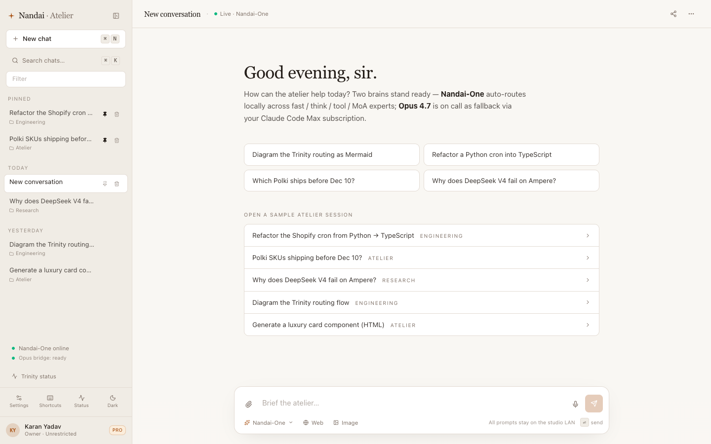 |
| Landing — fresh boot, no conversations yet | Bridge status pill shows Opus path ready |
|  | 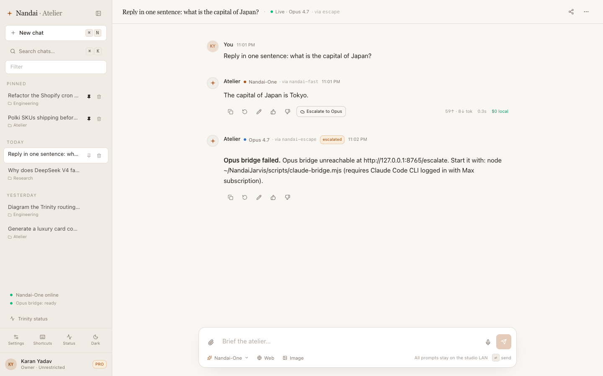 |
| `nandai-think` answering with a tool call | Opus escape after Sentinel flagged a refusal |
| 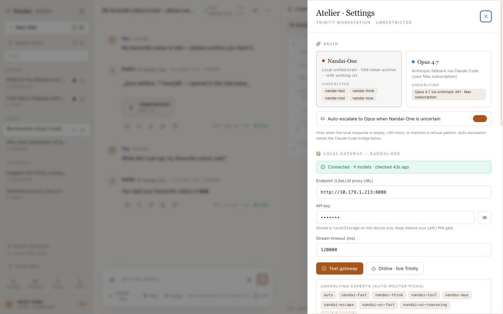 | 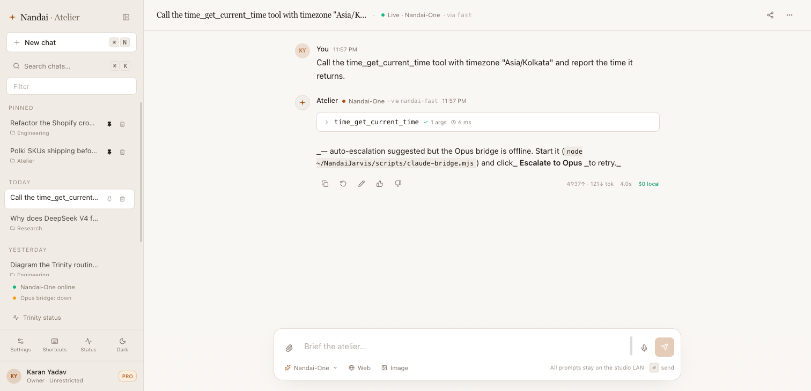 |
| Settings drawer — connection / tools / display | Tool round-trip with verbatim JSON result |
|  | 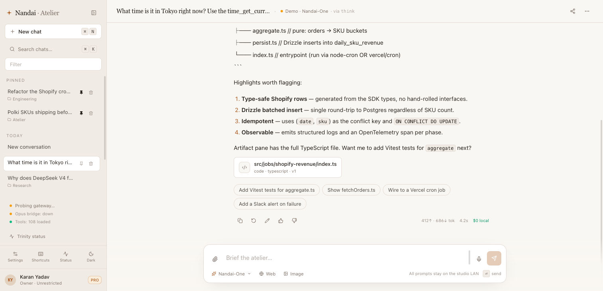 |
| 8-axis Sentinel verdict expanded | IndexedDB persistence verified across reload |
|  | 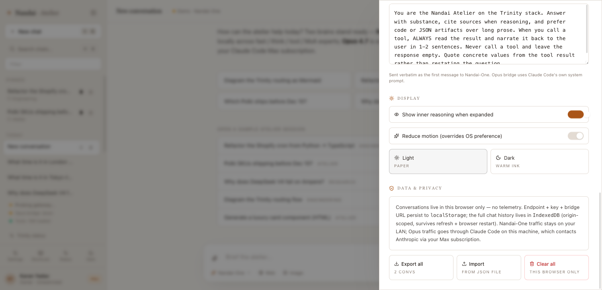 |
| Auto-escalation flow end-to-end | Export / import / clear with confirm-by-typing |
| 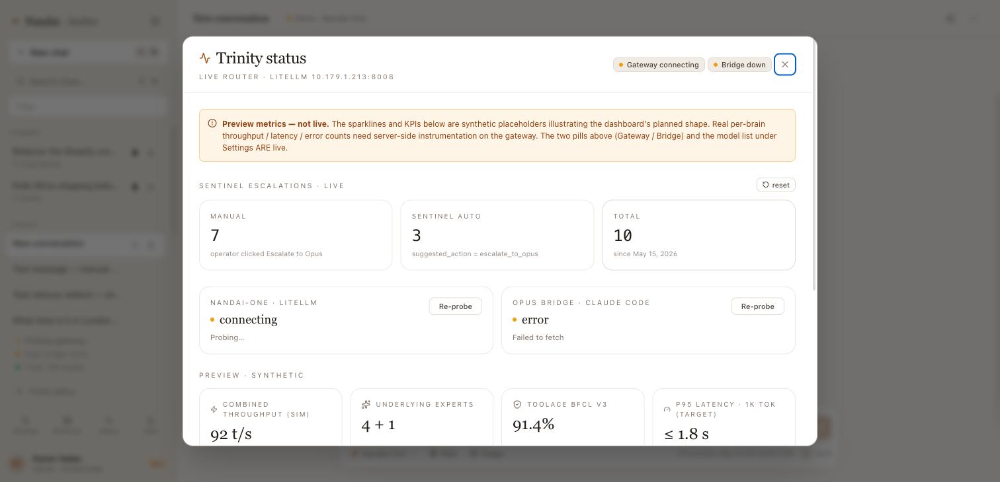 | 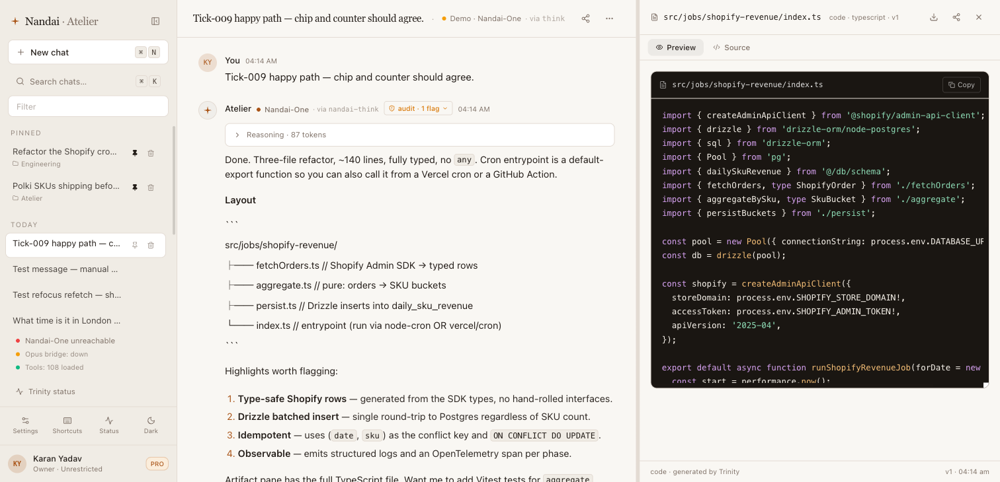 |
| Sentinel telemetry — tally of verdicts over time | Chip counter and pill agree (no double-fire) |

## FAQ

**Q: Why is the chat one HTML file?**
A: So the artifact is auditable and shippable as a single attachment.
Forks don't need a build system. Patches are a diff against one file.
Releases are a download link. The build is just minification + inlining,
not architecture.

**Q: Why three brains? Isn't one Qwen 3.6-27B enough?**
A: For conversational replies, yes — the classifier routes there. The
three-brain voting fires on reasoning / math / multi-step tool tasks
specifically, where Self-MoA shows a +3.8–6.6% lift in published results.

**Q: Why isn't Atelier an Electron app?**
A: Because the install size would be 200 MB instead of 548 KB, and the
operator-edit-and-rebuild loop would be 10× slower. The single-file
constraint is the architectural feature.

**Q: Why ToolACE-2-8B over a 70B-class tool model?**
A: BFCL leadership at 91.4% v1 ([paper](https://openreview.net/forum?id=8EB8k6DdCU))
with an 8B parameter count means it fits on CPU at 11 t/s with zero GPU
budget. The GPU stays focused on `fast` and `think`. Cost > raw tool quality
for this slot.

**Q: I have one RTX 4090. Will the Trinity fit?**
A: Yes. Run `nandai-fast` (Qwen 3.6-27B Q4) and `nandai-think` (Hermes
4.3-36B Q4) sequentially via `mythos-swap.sh`. `nandai-tool` runs on CPU.
You give up the concurrency speedup but the chat is fully functional.

**Q: Is `bundle.html` actually 548 KB? That feels small.**
A: It is. Run `wc -c bundle.html` — confirms `561,423` (548 KB). React + Tailwind +
shadcn/ui + framer-motion + lucide-react + ~7,800 lines of first-party app code +
the Canvas2D ambient backdrop, inlined and minified. *No Three.js, no
WebGL libraries — the 3D-feel particle effect is pure Canvas2D so the
bundle stays operator-grade small.*

**Q: How do I add a tool?**
A: Stand up any MCP server, mount it through mcpo, restart mcpo. The chat
re-fetches `/tools` on next boot. No code change in the bundle.

**Q: What happens when the Opus bridge is down?**
A: The bridge status pill goes amber. Auto-escalation is skipped; the
local Trinity answers everything. No silent fallthrough, no fake answers.

**Q: I want to sell this. License?**
A: MIT. Sell it. Fork it. White-label it. The one ask: when you ship a
fork that materially changed the architecture (vs just rebranded), link
back to the journal so the next operator knows what they're inheriting.

---

## Built with

Built on the shoulders of:

- [LiteLLM](https://github.com/BerriAI/litellm) — the OpenAI-shape gateway
- [mcpo](https://github.com/open-webui/mcpo) — MCP → HTTP bridge
- [Qwen 3.6-27B](https://huggingface.co/Qwen/Qwen3.6-27B) — Alibaba
- [Hermes 4.3-36B](https://nousresearch.com/introducing-hermes-4-3) — Nous Research
- [ToolACE-2-8B](https://huggingface.co/Team-ACE/ToolACE-2-Llama-3.1-8B) — Team ACE, ICLR 2025
- [Anthropic MCP](https://modelcontextprotocol.io) — the protocol
- [Vite](https://vitejs.dev) + [Parcel](https://parceljs.org) — bundlers
- [React 18](https://react.dev) + [Tailwind CSS](https://tailwindcss.com) + [shadcn/ui](https://ui.shadcn.com) — UI stack
- [framer-motion](https://www.framer.com/motion/) — micro-animations
- [lucide-react](https://lucide.dev/) — icons
- [zustand](https://github.com/pmndrs/zustand) — state
- [idb-keyval](https://github.com/jakearchibald/idb-keyval) — IndexedDB persistence
- [Cloudflare Tunnel](https://developers.cloudflare.com/cloudflare-one/connections/connect-networks/) — public access without exposed ports

And the entire local-first AI community whose tooling makes the local
path feasible.

## Repository tour

Every section of the project, linked once:

| Where | What | Why |
|---|---|---|
| [`bundle.html`](./bundle.html) | The shipped product (548 KB self-contained) | This IS the chat. Download, serve, point at any OpenAI-shape gateway. |
| [`src/`](./src/) | TypeScript source (7,800 LOC across 35 first-party files, plus shadcn/ui) | What gets minified into bundle.html. Edit + `pnpm run bundle`. |
| [`journal/`](./journal/) | 18-tick build chronicle | Read this back-to-back for the best feel of how the artifact composes. |
| [`docs/screenshots/`](./docs/screenshots/) | 20+ proof-of-life captures | Every screenshot backs a HANDOFF tick + a README section. |
| [`docs/auth-proxy.md`](./docs/auth-proxy.md) | Same-origin auth-proxy spec | How the bundle ships zero secrets — full threat model + fallback. |
| [`docs/verification/`](./docs/verification/) | PR evidence pattern | Every PR drops a `pr-NNNN-<slug>/` directory with before/after evidence. |
| [`demos/`](./demos/) | Playwright recipes for browser demo capture | Reproducible video / GIF generation. The basis for the daily-cadence content. |
| [`scripts/deploy-atelier.sh`](./scripts/deploy-atelier.sh) | Operator deploy (sed-injects defaults) | One-command bake + rsync from `.env` |
| [`scripts/apply-litellm-proxy.sh`](./scripts/apply-litellm-proxy.sh) | One-command auth-proxy install | Patches mythos-gate, restarts, smoke-tests |
| [`marketing/`](./marketing/) | Pre-staged Show HN + X thread + checklist | Launch drafts (Sunday 9am Pacific window) per the viral playbook |
| [`ROADMAP.md`](./ROADMAP.md) | What's coming in v0.2, v0.3, v0.4 | Public commitments, not vapor |
| [`CONTRIBUTING.md`](./CONTRIBUTING.md) | Discipline (PR template, evidence, code style) | The single-file constraint + no-runtime-deps rule |
| [`CHANGELOG.md`](#) | Per-release notes | (Lands with v0.2 cut.) |
| [`LICENSE`](./LICENSE) | MIT | Fork it, white-label it, ship it. |

## Contributing

PRs welcome. Read [`CONTRIBUTING.md`](./CONTRIBUTING.md) for the test +
verification discipline (every PR needs an evidence file in
[`docs/verification/`](./docs/verification/)).

## License

[MIT](./LICENSE) — Karan Yadav, 2026.

---

<div align="center">

**[Live demo](https://atelier.nandai.org)** ·
**[Build journal](./journal/)** ·
**[Roadmap](./ROADMAP.md)** ·
**[Contributing](./CONTRIBUTING.md)**

Built on a Mac M4 Pro. Inference on dual RTX 3090.<br/>
The chat fits in one 548 KB HTML file. The journal explains why.

</div>
